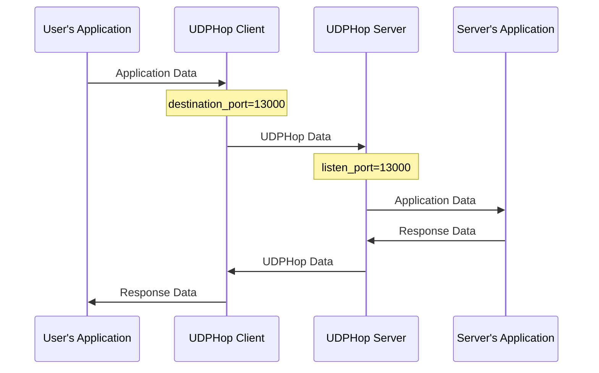

# UDPHop General Configurations

## Basic Configuration File
Here is the most basic configuration file, which can be modified according to personal needs.

In this mode, the server only provides a single port connection. However, in order to avoid QoS as much as possible, the client will still try to change the sending port every 1 minute (unless this option is disabled by setting dport_refresh to 0).

Example of client mode:
```
mode=client
listen_port=59000
destination_port=13000
destination_address=123.45.67.89
dport_refresh=60
encryption_password=qwerty1234
encryption_algorithm=AES-GCM
```

Example of server mode:
```
mode=server
listen_port=13000
destination_port=59000
destination_address=::1
encryption_password=qwerty1234
encryption_algorithm=AES-GCM
stun_server=stun.qq.com
log_path=./
```

Process:

## Dynamic port mode

In this mode, the server specifies a continuous port range, and the client randomly selects one of the port numbers to establish a connection when connecting, and then changes the port number every 1 minute.

Example of client mode:
```
mode=client
listen_port=59000
destination_port=13000-14000
destination_address=123.45.67.89
dport_refresh=60
encryption_password=qwerty1234
encryption_algorithm=AES-GCM
```

Example of server mode:
```
mode=server
listen_port=13000-14000
destination_port=59000
destination_address=::1
encryption_password=qwerty1234
encryption_algorithm=AES-GCM
stun_server=stun.qq.com
log_path=./
```

If you want to change the port every 5 minutes (i.e. 600 seconds), you can add `dport_refresh=600` to the client configuration file.

The `listen_port` in client mode have to be the same as / smaller than the `destination_port` in server mode. Otherwise the client may select the wrong port and fail to connect.

## NAT Hole punching with STUN

If the server is behind NAT, you can fill in the STUN server address in the configuration file. Only available for Server Mode.

```
mode=server
listen_port=13000
destination_port=59000
destination_address=::1
encryption_password=qwerty1234
encryption_algorithm=AES-GCM
stun_server=stun.qq.com
log_path=./
```

When using STUN for NAT Hole punching, the server cannot listen on multiple ports and can only use single-port mode. This is because the port number obtained after NAT Hole punching using STUN is not fixed. Even if the server's own port range is continuous, it cannot be guaranteed that the port number range obtained during NAT Hole punching is also continuous. Therefore, in this mode, UDPHop is limited to using only single-port mode.

## Specify the listening NIC

Both the client and the server can specify the NIC to listen to, and only need to specify the IP address of the NIC. Just add a line

```
listen_on=192.168.1.1
```

## Multiple Configuration Files

If you want to listen to multiple ports and multiple NICs, you can pass multiple configuration files to kcptube and use them at the same time

```
UDPHop config1.conf config2.conf
```