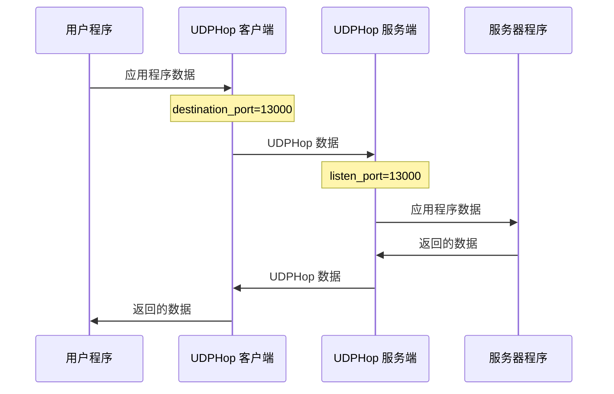

# UDPHop 常规配置

## 最基础的配置文件
这是最为基础的配置文件，可以按照个人需求修改相应配置。

在这个模式，服务端只提供单个端口连接。但为了尽量躲避 QoS，客户端仍然会尝试每隔 1 分钟就换一次发送端口。

客户端模式示例：
```
mode=client
listen_port=59000
destination_port=13000
destination_address=123.45.67.89
dport_refresh=60
encryption_password=qwerty1234
encryption_algorithm=AES-GCM
```

服务端模式示例：
```
mode=server
listen_port=13000
destination_port=59000
destination_address=::1
encryption_password=qwerty1234
encryption_algorithm=AES-GCM
stun_server=stun.qq.com
log_path=./
```

流程：

## 动态端口模式

在这个模式，服务端指定一段连续的端口范围，客户端在连接时随机选择其中一个端口号建立连接，随后每隔 1 分钟就换一个端口号。

客户端模式示例：
```
mode=client
listen_port=59000
destination_port=13000-14000
destination_address=123.45.67.89
dport_refresh=60
encryption_password=qwerty1234
encryption_algorithm=AES-GCM
```

服务端模式示例：
```
mode=server
listen_port=13000-14000
destination_port=59000
destination_address=::1
encryption_password=qwerty1234
encryption_algorithm=AES-GCM
stun_server=stun.qq.com
log_path=./
```

如果想要 5 分钟（即 600 秒）才更换端口，那么可以在客户端配置文件内加上 `dport_refresh=600`。

客户端模式的 `listen_port` 必须等于小于服务端模式的 `destination_port`，以免客户端选错端口连接不上。

## 使用 STUN 打洞

如果服务端位于 NAT 后方，那么可以在服务器端的配置文件内填入 STUN 服务器地址。

```
mode=server
listen_port=13000
destination_port=59000
destination_address=::1
encryption_password=qwerty1234
encryption_algorithm=AES-GCM
stun_server=stun.qq.com
log_path=./
```

注意：使用 STUN 打洞时，服务端无法监听多端口，只能使用单端口模式。因为 STUN 打洞后获得的端口号并不固定，即使服务端自己的端口范围是连续的，打洞时无法保证获得的端口号范围也是连续的。因此这种模式下 UDPHop 限制为只能使用单端口模式。

## 指定侦听网卡

客户端及服务端都可以指定侦听的网卡，只须指定该网卡的 IP 地址。加一行即可

```
listen_on=192.168.1.1
```

## 多个配置文件

如果想要侦听多个端口、多个网卡，那就分开多个配置文件，然后同时使用

```
UDPHop config1.conf config2.conf
```