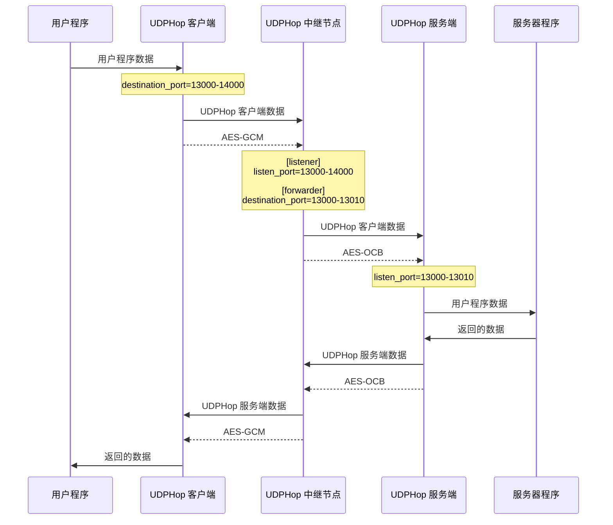

# UDPHop 中继模式配置

## 配置文件示例

客户端模式示例：
```
mode=client
listen_port=59000
destination_port=13000-14000
destination_address=123.45.67.89
dport_refresh=60
encryption_password=qwerty1234
encryption_algorithm=AES-GCM
```

中继模式示例：
```
mode=relay

[listener]
listen_port=13000-14000
encryption_password=qwerty1234
encryption_algorithm=AES-GCM
keep_alive=10

[forwarder]
destination_port=13000-14000
destination_address=127.0.0.1
encryption_password=qwerty1234
encryption_algorithm=AES-OCB
keep_alive=10
```

服务端模式示例：
```
mode=server
listen_port=13000-13010
destination_port=59000
destination_address=::1
encryption_password=qwerty1234
encryption_algorithm=AES-OCB
stun_server=stun.qq.com
log_path=./
```

留意看的话可以发现，客户端、服务端的部份设置与加密选项都不一样。

没错，只需要正确配置中转站两侧各自的通道即可，中继节点在转发时会重新加密。

除此之外，即使一侧通道使用动态端口，另一侧不使用动态端口，也是可以的。

流程：


## 配置文件可共用选项

以下配置选项可以在`[listener]`、`[forwarder]`标签外使用：
- encryption_password
- encryption_algorithm
- timeout
- keep_alive
- ipv4_only=1
- fec

若出现在节点标签外，就会覆盖所有节点标签内的对应值。其中`ipv4_only=1`是特例，只有`ipv4_only=1`时才覆盖，`ipv4_only=0`时并不会覆盖。

因为`ipv4_only=0`的意思是，使用默认设置，即双栈模式。

## 注意事项
若需要自行配置 `timeout`，请确保中继节点的 `timeout` 应当大于等于服务端与客户端的 `timeout` 值，以免过早清理转发链路。

## 关于节点标签
配置中继模式时，必须明确写出两个节点标签——`[listener]` 与 `[forwarder]`，不可忽略。